# flutter_neumorphic

A complete, ready to use, Neumorphic ui kit for Flutter

[](https://github.com/Idean/Flutter-Neumorphic)

Try Flutter-Neumorphic on your browser : 👉 https://flutter-neumorphic.firebaseapp.com/ 🌐

[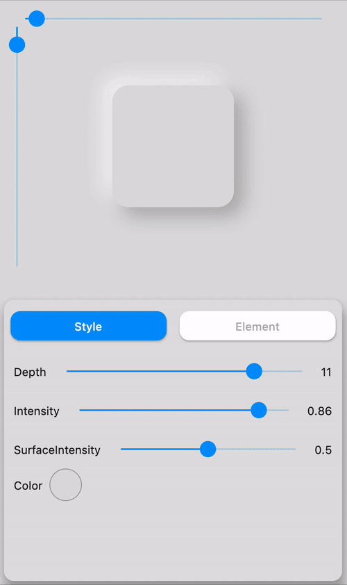](https://github.com/Idean/Flutter-Neumorphic)

# ⚙️ Installation

https://pub.dev/packages/flutter_neumorphic

[](
https://pub.dartlang.org/packages/flutter_neumorphic)
[](https://github.com/Idean/Flutter-Neumorphic)


```dart
dependencies:
  flutter_neumorphic: ^3.0.1

//requires flutter > 1.13.18
```

The in your .dart files 
```dart
import 'package:flutter_neumorphic/flutter_neumorphic.dart';
```

# 🗂 Widgets

<table>
<thead>
<tr>
<th>Preview</th>
<th>Widget</th>
<th>Description</th>
</tr>
</thead>
<tbody>
<tr>
  <td></td>
  <td>Neumorphic</td>
  <td>The main Neumorphic Widget, a container which adds white/dark gradient depending on a lightsource and a depth </td>
</tr>
<tr>
  <td></td>
  <td>NeumorphicButton</td>
  <td>A neumorphic button that plays with the depth to respond to user interraction</td>
</tr>
<tr>
  <td></td>
  <td>NeumorphicRadio</td>
  <td>A set of neumorphic button whith only one selected at time, depending on a value and groupValue</td>
</tr>
<tr>
  <td></td>
  <td>NeumorphicCheckbox</td>
  <td> A button associated with a value, can be checked/unckecked, if checked, takes the accent color</td>
</tr>

<tr>
  <td></td>
  <td>NeumorphicText</td>
  <td>A Neumorphic text (only work with positive depth)</td>
</tr>
<tr>
  <td></td>
  <td>NeumorphicIcon</td>
  <td>A Neumorphic icon (only work with positive depth)</td>
</tr>
<tr>
  <td></td>
  <td>material.TextField</td>
  <td>For TextFields, just surround your existing material textfield widget with a Neumorphic (container)</td>
</tr>

<tr>
  <td> </td>
  <td>NeumorphicSwitch</td>
  <td>An On/Off toggle, associated with a value, if toggled, takes the accent color </td>
</tr>
<tr>
  <td> </td>
  <td>NeumorphicToggle</td>
  <td>An mutiple value toggle, associated with a selecteedIndex</td>
</tr>
<tr>
  <td></td>
  <td>NeumorphicSlider</td>
  <td>A Neumorphic seekbar (range slider), the user can select a value in a range</td>
</tr>
<tr>
  <td></td>
  <td>NeumorphicProgress</td>
  <td>A determinate progress, takes the displayed percentage</td>
</tr>
<tr>
  <td> </td>
  <td>NeumorphicIndeterminateProgress</td>
  <td>An inderminate progress-bar</td>
</tr>
<tr>
  <td> </td>
  <td>NeumorphicBackground</td>
  <td>Take the background color of the theme, can clip the screen with a borderRadius</td>
</tr>
<tr>
  <td> </td>
  <td>NeumorphicApp</td>
  <td>An application that uses Neumorphic design. Handle theme, navigation, localisation, and much more</td>
</tr>
<tr>
  <td> </td>
  <td>NeumorphicAppBar</td>
  <td>A Neumorphhic design app bar. Can be used inside Scaffold</td>
</tr>

</tbody>
</table>

## 👀 Showcases

[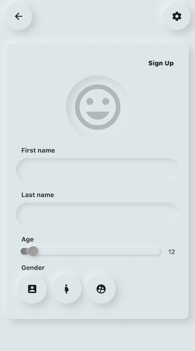](https://github.com/Idean/Flutter-Neumorphic)
[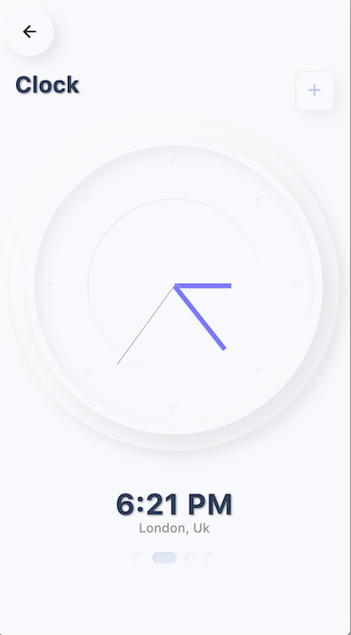](https://github.com/Idean/Flutter-Neumorphic)

[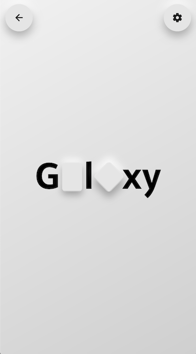](https://github.com/Idean/Flutter-Neumorphic)
[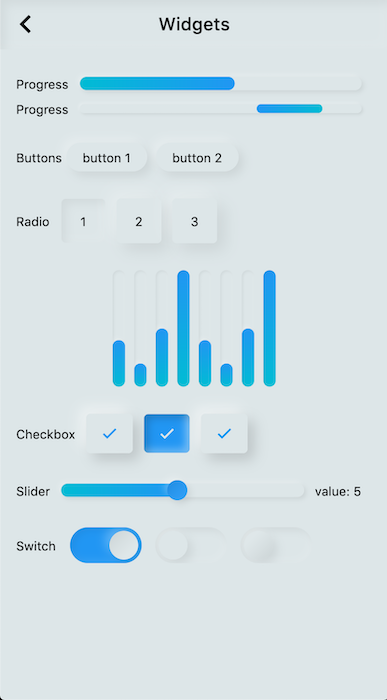](https://github.com/Idean/Flutter-Neumorphic)

## 📦 Neumorphic

```dart

Neumorphic(
  style: NeumorphicStyle(
    shape: NeumorphicShape.concave,
    boxShape: NeumorphicBoxShape.roundRect(borderRadius: BorderRadius.circular(12)), 
    depth: 8,
    lightSource: LightSource.topLeft,
    color: Colors.grey
  ),
  child: ...
)
```

[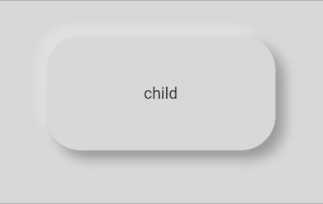](https://github.com/Idean/Flutter-Neumorphic)
[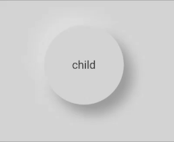](https://github.com/Idean/Flutter-Neumorphic)

☝️ Playing with LightSource & Depth


### 🛠️ Attributes

| Attributes | Values | Description |
|------------|--------|-------------|
| LightSource | TopLeft, BottomRight, etc. / (dx, dy) | The source of light specifit to the theme or the widget, used to project white/dark shadows on neumorphic elements |
| [Shape](#-shapes) | Concave / Convex / Flat | The shape of the curve used in the neumorphic container |
| [Depth](#depth) | -20 <= double <= 20 | The distance of the widget to his parent. Can be negative => emboss. It influences on the shadow's color and its size/blur |
| [Intensity](#intensity) | 0 <= double <= 1 | The intensity of the Light, it influences on the shadow's color |
| [SurfaceIntensity](surfaceintensity) | 0 <= double <= 1 | The intensity of the Surface, it influences on the concave/convex darkness |
| Color | any Color | The default color of  Neumorphic elements | 
| Accent | any Color | The default accent color of the Neumorphic element when activated (eg: checkbox) | 
| Variant | any Color | The default secondary color of the Neumorphic element (eg: used as second color on the progress gradient) | 
| [BoxShape](#-custom-shape) | Circle, RoundRect(radius), Stadium, Path | The box shape of a Neumorphic element. Stadium : roundrect with cirlces on each side | 
| [Border](#-accessibility--border) | NeumorphicBorder | A border (color/width) to enhance contrast with background and others elements | 

[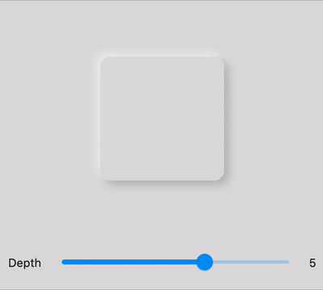](https://github.com/Idean/Flutter-Neumorphic)
[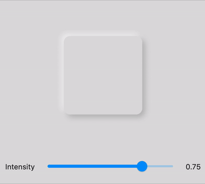](https://github.com/Idean/Flutter-Neumorphic)
[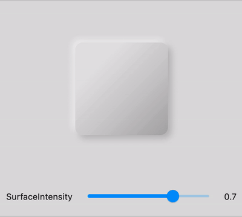](https://github.com/Idean/Flutter-Neumorphic)
[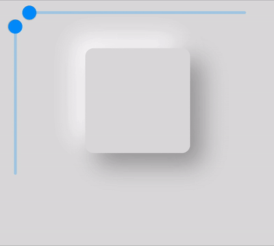](https://github.com/Idean/Flutter-Neumorphic)


### 🔧 Shapes

<table>
<thead>
<tr>
<th>Shape</th>
<th>Widget</th>
<th>Image</th>
<th>Condition</th>
</tr>
</thead>
<tbody>

<tr>
  <td>Flat</td>
  <td></td>
  <td> </td>
  <td>depth >= 0 && shape == Flat</td>
</tr>


<tr>
  <td>Convex</td>
  <td></td>
  <td> </td>
  <td>depth >= 0 && shape == Convex</td>
</tr>


<tr>
  <td>Concave</td>
  <td></td>
  <td> </td>
  <td>depth >= 0 && shape == Concave</td>
</tr>


<tr>
  <td>Emboss</td>
  <td></td>
  <td> </td>
  <td>depth < 0</td>
</tr>

</tbody>
</table>

## Neumorphic Tewt

[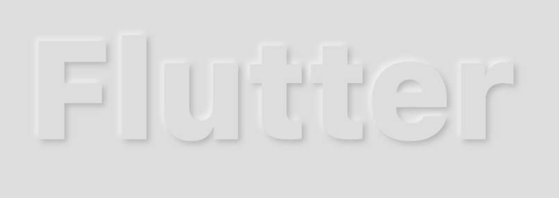](https://github.com/Idean/Flutter-Neumorphic)

**Text only handle positive depth**

```dart
child: NeumorphicText(
        "I love flutter",
        style: NeumorphicStyle(
          depth: 4,  //customize depth here
          color: Colors.white, //customize color here
        ),
        textStyle: NeumorphicTextStyle(
          fontSize: 18, //customize size here
          // AND others usual text style properties (fontFamily, fontWeight, ...)
        ),
    ),
```


## Neumorphic Icon

[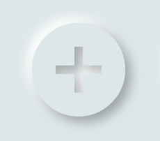](https://github.com/Idean/Flutter-Neumorphic)

```dart
child: NeumorphicIcon(
        Icons.add_circle,
        size: 80,
    ),
```

How to display **SVG** icons ?

Simply use [https://fluttericon.com/](https://fluttericon.com/) to export your svg as .ttf & use NeumorphicIcon(YOUR_ICON) 

[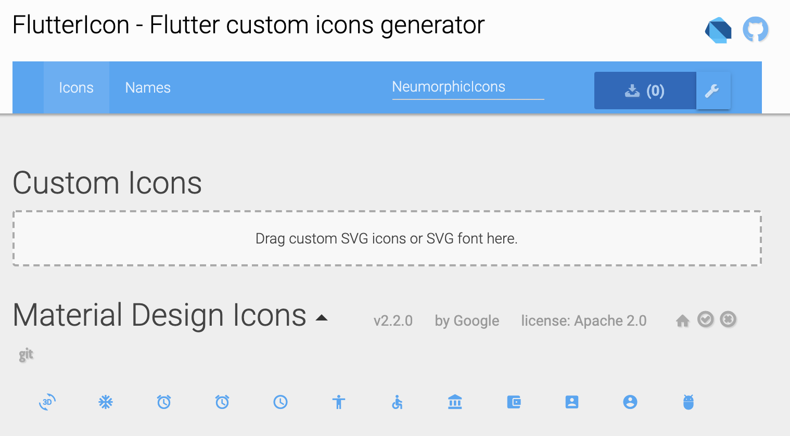](https://fluttericon.com/)

## 🎨 Custom Shape

[](https://github.com/Idean/Flutter-Neumorphic)

Flutter Neumorphic supports custom shapes, just provide a path to 

```dart
class MyShapePathProvider extends NeumorphicPathProvider {
  @override
  bool shouldReclip(NeumorphicPathProvider oldClipper) {
    return true;
  }

  @override
  Path getPath(Size size) {
    return Path()
      ..moveTo(0, 0)
      ..lineTo(size.width/2, 0)
      ..lineTo(size.width, size.height/2)
      ..lineTo(size.width/2, size.height/2)
      ..lineTo(size.width, size.height)
      ..lineTo(0, size.height)
      ..close();
  }
}
```

And use `NeumorphicBoxShape.path`

```dart
Neumorphic(
  style: NeumorphicStyle(
     boxShape: NeumorphicBoxShape.path(MyShapePathProvider()),
  ),
  ...
),
```

You can import the Flutter logo as a custom shape using 

```dart
Neumorphic(
  style: NeumorphicStyle(
    shape: NeumorphicBoxShape.path(NeumorphicFlutterLogoPathProvider()),
  ),
  ...
),
```

## 🔲 Accessibility / Border

For design purposes, or simply to enhance accessibility, 
you can add a border on Neumorphic widgets 

[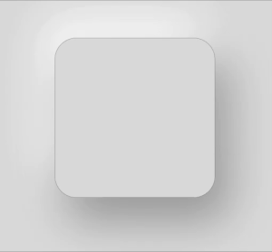](https://github.com/Idean/Flutter-Neumorphic)

```dart
Neumorphic(
      style: NeumorphicStyle(
        border: NeumorphicBorder(
          color: Color(0x33000000),
          width: 0.8,
        )
      ),
      ...
)
```

You can enable/disable it (eg: listening an Accessibility Provider) with `isEnabled`

```dart
border: NeumorphicBorder(
    isEnabled: true,
    color: Color(0x33000000),
    width: 0.8,
)
```

Note that `borderColor` and `borderWidth` default values has been added to `NeumorphicThemeData`

## 🎨 Neumorphic Theme


[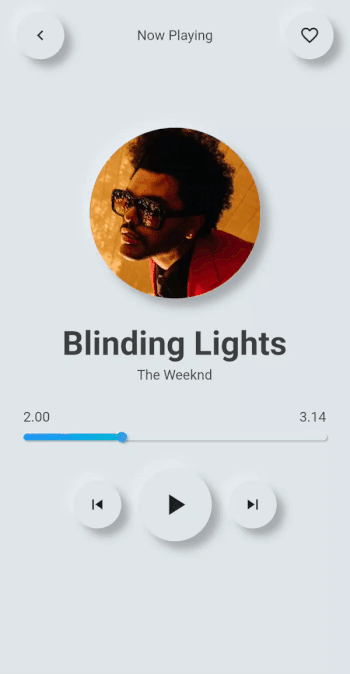](https://github.com/Idean/Flutter-Neumorphic)
[](https://github.com/Idean/Flutter-Neumorphic)

```dart
NeumorphicTheme(
    themeMode: ThemeMode.light, //or dark / system
    darkTheme: NeumorphicThemeData(
        baseColor: Color(0xff333333),
        accentColor: Colors.green,
        lightSource: LightSource.topLeft,
        depth: 4,
        intensity: 0.3,
    ),
    theme: NeumorphicThemeData(
        baseColor: Color(0xffDDDDDD),
        accentColor: Colors.cyan,
        lightSource: LightSource.topLeft,
        depth: 6,
        intensity: 0.5,
    ),
    child: ...
)
```

To retrieve the current used theme :

```dart
final theme = NeumorphicTheme.currentTheme(context);
final baseColor = theme.baseColor;
final accentColor = theme.accentColor;
...
```

Toggle from light to dark
```dart
NeumorphicTheme.of(context).themeMode = ThemeMode.dark;
```

Know if using dark
```dart
if(NeumorphicTheme.of(context).isUsingDark){
  
}
```

# NeumorphicApp

You can use direcly in your project a `NeumorphicApp`, surrounding your code

It handle directly NeumorphicTheme & Navigation (and all possibilities of MaterialApp )

```dart
void main() => runApp(MyApp());

class MyApp extends StatelessWidget {
  // This widget is the root of your application.
  @override
  Widget build(BuildContext context) {
    return NeumorphicApp(
      debugShowCheckedModeBanner: false,
      title: 'Neumorphic App',
      themeMode: ThemeMode.light,
      theme: NeumorphicThemeData(
        baseColor: Color(0xFFFFFFFF),
        lightSource: LightSource.topLeft,
        depth: 10,
      ),
      darkTheme: NeumorphicThemeData(
        baseColor: Color(0xFF3E3E3E),
        lightSource: LightSource.topLeft,
        depth: 6,
      ),
      home: MyHomePage(),
    );
  }
}
```

# What's neumorphic

[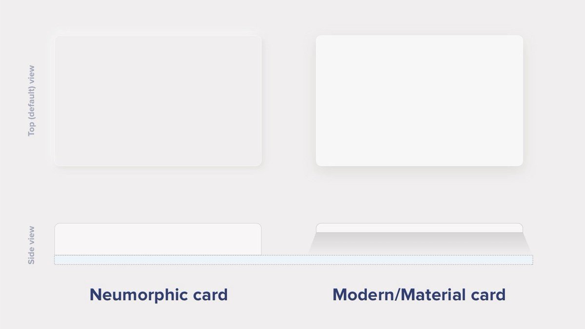]()

## Material Cards

A Modern / Material (upgraded) card usually is a surface floating on top of our perceived background and casting a shadow onto it. The shadow both gives it depth and also in many cases defines the shape itself — as it’s quite often borderless.

## Neumorphic cards

Neumorphic card however pretends to extrude from the background. It’s a raised shape made from the exact same material as the background. When we look at it from the side we see that it doesn’t “float”.

[](https://github.com/Idean/Flutter-Neumorphic)

Here's a Nereumorphic Button tap (slowed x2) from the sample app, you can see how the element seems to change its depth to its surface.


# 👥 Contributors


|                                                                                | Contributors |
|:------------------------------------------------------------------------------:|--------------|
| [](https://github.com/florent37) | [Florent Champigny](https://github.com/florent37) |
| [](https://github.com/Debilobob)  | [Olivier Bonvila](https://github.com/Debilobob)  |
| [](https://github.com/almighty972)        | [Gyl Jean Lambert](https://github.com/almighty972)  |
| [](https://github.com/jaumard)    | [Jimmy Aumard](https://github.com/jaumard)  |
| [](https://github.com/Overman775)    | [Overman775](https://github.com/Overman775)  |
| [](https://github.com/schopy)    | [schopy](https://github.com/schopy)  |


## 📄 License


Flutter-Neumorphic is released under the Apache2 license.
See [LICENSE](./LICENSE) for details.

If you use the open-source library in your project, please make sure to credit and backlink to www.idean.com

[](https://www.idean.com)
